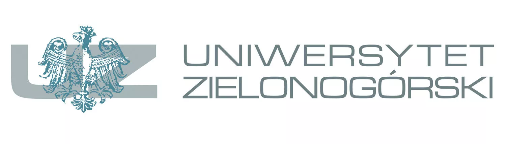

<center>

# Projekt R

### Sprawozdanie z realizacji projektu

#### Eksploracja zasobów internetowych

09.01.2024

Prowadzący: dr hab. inż. Artur Gramacki, prof. UZ\
Grupa: 31E-B-SP/B

Miłosz Szymczak [106834\@stud.uz.zgora.pl](mailto:106834@stud.uz.zgora.pl){.email} Tomasz Szytuła [106835\@stud.uz.zgora.pl](mailto:106835@stud.uz.zgora.pl){.email} Kuba Siupa [106832\@stud.uz.zgora.pl](mailto:106832@stud.uz.zgora.pl){.email}

## 

## Kod R

</center>
``

```{r message=FALSE}

library(tm)
library(plotly)
```
### Odczyt pliku
```{r message=FALSE}
file_path <- "book_ang.txt" 
text <- (readLines(file_path, warn = FALSE,encoding = "UTF-8"))
text <- text[text != ""] #usuwanie pustych lini

```
### Tworzenie 'korpusu' tekstu
```{r message=FALSE }
corpus <- Corpus(VectorSource(text))
head(corpus$content[1])
```
### Zamiana tekstu na małą litere 
```{r message=FALSE}
corpus <- tm_map(corpus, content_transformer(tolower))
head(corpus$content[1])
```
### Usuwanie znaków interpunkcji
```{r message=FALSE}
corpus <- tm_map(corpus, removePunctuation)
head(corpus$content[1])
```
### Usuwanie Liczb
```{r message=FALSE}
corpus <- tm_map(corpus, removeNumbers)
head(corpus$content[1])
```
### Usuwanie stopwords
```{r message=FALSE}
corpus <- tm_map(corpus, removeWords, stopwords("english"))
head(corpus$content[1])
```
### Usuwanie pustej przestrzeni
```{r message=FALSE}
corpus <- tm_map(corpus, stripWhitespace)
head(corpus$content[1])

dtm <- DocumentTermMatrix(corpus)

```
### konwersja do macierza
```{r message=FALSE}
matrix_dtm <- as.matrix(dtm)

```
### obliczanie SVD
```{r message=FALSE}
svd_result <- svd(matrix_dtm)
u <- svd_result$u
d <- svd_result$d
```
### Zatrzymanie tylko 1 wartosci i korespondujacych wektorów
```{r message=FALSE}
u1 <- u[, 1]
d1 <- d[1]
```
### Wyciaganie top 10 zdań
```{r message=FALSE}
sentence_scores <- u1 * d1
top_sentences_indices <- order(sentence_scores, decreasing = FALSE)[1:10]
top_sentences <- text[top_sentences_indices]
list(top_sentences)
```
### Wyciaganie top 10 słów
```{r message=FALSE}
v1 <- svd_result$v[, 1]
top_terms_indices <- order(v1, decreasing = FALSE)[1:10]
top_terms <- colnames(matrix_dtm)[top_terms_indices]
list(top_terms)

sentences_df <- data.frame(Sentence = text, Score = sentence_scores)
```
### Interaktywny wykres słów
```{r message=FALSE,echo=FALSE}
terms_df <- data.frame(Term = colnames(matrix_dtm), Value = v1)
 term_plot <- plot_ly(data = terms_df, x = ~Term, y = ~abs(Value), type = "bar") %>%
layout(title = "Wartości Słów", xaxis = list(tickmode = "array", tickvals = NULL, ticktext = NULL))
 
term_plot
```
### Interaktywny wykres zdań
```{r message=FALSE,echo=FALSE}
library(plotly)

sentences_df <- data.frame(Sentence = text, Score = sentence_scores)

sentence_plot <- plot_ly(data = sentences_df, x = ~Sentence, y = ~abs(Score), type = "bar") %>%
  layout(title = "Wartości Zdań", xaxis = list(tickmode = "array", tickvals = NULL, ticktext = NULL))

sentence_plot
```
### Wnioski 
W naszym projekcie, wykorzystując język R, przeprowadziliśmy analizę tekstu z pliku "book_ang.txt". Przetworzyliśmy ten tekst, tworząc macierz termów-dokumentów oraz przeprowadzając Singular Value Decomposition (SVD). Następnie, wykorzystując wyniki analizy, wyróżniliśmy 10 najważniejszych zdań oraz 10 kluczowych słów w tekście. Ostatecznie, stworzyliśmy interaktywny wykres słów, co pozwoliło nam wizualizować i lepiej zrozumieć istotne treści zawarte w tekście.


