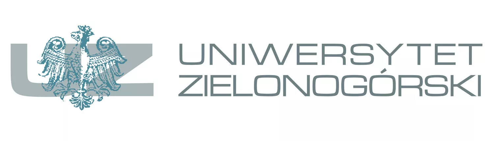

```{r setup, include=FALSE} 
knitr::opts_chunk$set(warning = FALSE, message = FALSE) 
```
<center>

# Projekt R

### Sprawozdanie z realizacji projektu

#### Eksploracja zasobów internetowych

09.01.2024

Prowadzący: dr hab. inż. Artur Gramacki, prof. UZ\
Grupa: 31E-B-SP/B

Miłosz Szymczak [106834\@stud.uz.zgora.pl](mailto:106834@stud.uz.zgora.pl){.email} Tomasz Szytuła [106835\@stud.uz.zgora.pl](mailto:106835@stud.uz.zgora.pl){.email} Kuba Siupa [106832\@stud.uz.zgora.pl](mailto:106832@stud.uz.zgora.pl){.email}

## 

## Kod R

</center>
### Polskie znaki specjalne
```{r}
polish_stopwords <- c("a","aby","ach","acz","aczkolwiek","aj","albo","ale","alez","ależ","ani","az","aż","bardziej","bardzo","beda","bedzie","bez","deda","będą","bede","będę","będzie","bo","bowiem","by","byc","być","byl","byla","byli","bylo","byly","był","była","było","były","bynajmniej","cala","cali","caly","cała","cały","ci","cie","ciebie","cię","co","cokolwiek","cos","coś","czasami","czasem","czemu","czy","czyli","daleko","dla","dlaczego","dlatego","do","dobrze","dokad","dokąd","dosc","dość","duzo","dużo","dwa","dwaj","dwie","dwoje","dzis","dzisiaj","dziś","gdy","gdyby","gdyz","gdyż","gdzie","gdziekolwiek","gdzies","gdzieś","go","i","ich","ile","im","inna","inne","inny","innych","iz","-","iż","ja","jak","jakas","jakaś","jakby","jaki","jakichs","jakichś","jakie","jakis","jakiś","jakiz","jakiż","jakkolwiek","jako","jakos","jakoś","ją","je","jeden","jedna","jednak","jednakze","jednakże","jedno","jego","jej","jemu","jesli","jest","jestem","jeszcze","jeśli","jezeli","jeżeli","juz","już","kazdy","każdy","kiedy","kilka","kims","kimś","kto","ktokolwiek","ktora","ktore","ktorego","ktorej","ktory","ktorych","ktorym","ktorzy","ktos","ktoś","która","które","którego","której","który","których","którym","którzy","ku","lat","lecz","lub","ma","mają","mało","mam","mi","miedzy","między","mimo","mna","mną","mnie","moga","mogą","moi","moim","moj","moja","moje","moze","mozliwe","mozna","może","możliwe","można","mój","mu","musi","my","na","nad","nam","nami","nas","nasi","nasz","nasza","nasze","naszego","naszych","natomiast","natychmiast","nawet","nia","nią","nic","nich","nie","niech","niego","niej","niemu","nigdy","nim","nimi","niz","niż","no","o","obok","od","około","on","ona","one","oni","ono","oraz","oto","owszem","pan","pana","pani","po","pod","podczas","pomimo","ponad","poniewaz","ponieważ","powinien","powinna","powinni","powinno","poza","prawie","przeciez","przecież","przed","przede","przedtem","przez","przy","roku","rowniez","również","sam","sama","są","sie","się","skad","skąd","soba","sobą","sobie","sposob","sposób","swoje","ta","tak","taka","taki","takie","takze","także","tam","te","tego","tej","ten","teraz","też","to","toba","tobą","tobie","totez","toteż","totobą","trzeba","tu","tutaj","twoi","twoim","twoj","twoja","twoje","twój","twym","ty","tych","tylko","tym","u","w","wam","wami","was","wasz","wasza","wasze","we","według","wiele","wielu","więc","więcej","wlasnie","właśnie","wszyscy","wszystkich","wszystkie","wszystkim","wszystko","wtedy","wy","z","za","zaden","zadna","zadne","zadnych","zapewne","zawsze","ze","zeby","zeznowu","zł","znow","znowu","znów","zostal","został","żaden","żadna","żadne","żadnych","że","żeby")

```

```{r message=FALSE }

library(tm)
library(plotly)
```
### Odczyt pliku
```{r message=FALSE}
file_path <- "book_pl.txt" 
text <- (readLines(file_path, warn = FALSE,encoding = "UTF-8"))
text <- text[text != ""] #usuwanie pustych lini

```
### Tworzenie 'korpusu' tekstu
```{r message=FALSE }
corpus <- Corpus(VectorSource(text))
head(corpus$content[1])
```
### Zamiana tekstu na małą litere 
```{r message=FALSE}
corpus <- tm_map(corpus, content_transformer(tolower))
head(corpus$content[1])
```
### Usuwanie znaków interpunkcji
```{r message=FALSE}
corpus <- tm_map(corpus, removePunctuation)
head(corpus$content[1])
```
### Usuwanie Liczb
```{r message=FALSE}
corpus <- tm_map(corpus, removeNumbers)
head(corpus$content[1])
```
### Usuwanie 'stopwords'
```{r message=FALSE}
corpus <- tm_map(corpus, removeWords,  polish_stopwords)
head(corpus$content[1])
```
### Usuwanie pustej przestrzeni
```{r message=FALSE}
corpus <- tm_map(corpus, stripWhitespace)
head(corpus$content[1])

dtm <- DocumentTermMatrix(corpus)

```
### konwersja do macierza
```{r message=FALSE}
matrix_dtm <- as.matrix(dtm)

```
### obliczanie SVD
```{r message=FALSE}
svd_result <- svd(matrix_dtm)
u <- svd_result$u
d <- svd_result$d
```
### Zatrzymanie tylko 1 wartosci i korespondujacych wektorów
```{r message=FALSE}
u1 <- u[, 1]
d1 <- d[1]
```
### Wyciaganie top 10 zdań
```{r message=FALSE, echo=FALSE}
sentence_scores <- u1 * d1
top_sentences_indices <- order(sentence_scores, decreasing = FALSE)[1:10]
top_sentences <- text[top_sentences_indices]
list(top_sentences)
```
### Wyciaganie top 10 słów
```{r message=FALSE,echo=FALSE}
v1 <- svd_result$v[, 1]
top_terms_indices <- order(v1, decreasing = FALSE)[2:11]
top_terms <- colnames(matrix_dtm)[top_terms_indices]
list(top_terms)
```
### Interaktywny wykres słów
```{r message=FALSE,echo=FALSE}
terms_df <- data.frame(Term = colnames(matrix_dtm), Value = v1)
 term_plot <- plot_ly(data = terms_df, x = ~Term, y = ~abs(Value), type = "bar") %>%
layout(title = "Wartości Słów", xaxis = list(tickmode = "array", tickvals = NULL, ticktext = NULL))
 
term_plot
```
### Interaktywny wykres zdań
```{r message=FALSE,echo=FALSE}
library(plotly)

sentences_df <- data.frame(Sentence = text, Score = sentence_scores)

sentence_plot <- plot_ly(data = sentences_df, x = ~Sentence, y = ~abs(Score), type = "bar") %>%
  layout(title = "Wartości Zdań", xaxis = list(tickmode = "array", tickvals = NULL, ticktext = NULL))

sentence_plot
```
### Wnioski 
W naszym projekcie, wykorzystując język R, przeprowadziliśmy analizę tekstu z pliku "book_pl.txt".Stworzyliśmy własną baze Polskich Stopwords .Przetworzyliśmy ten tekst, tworząc macierz termów-dokumentów oraz przeprowadzając Singular Value Decomposition (SVD). Następnie, wykorzystując wyniki analizy, wyróżniliśmy 10 najważniejszych zdań oraz 10 kluczowych słów w tekście.
